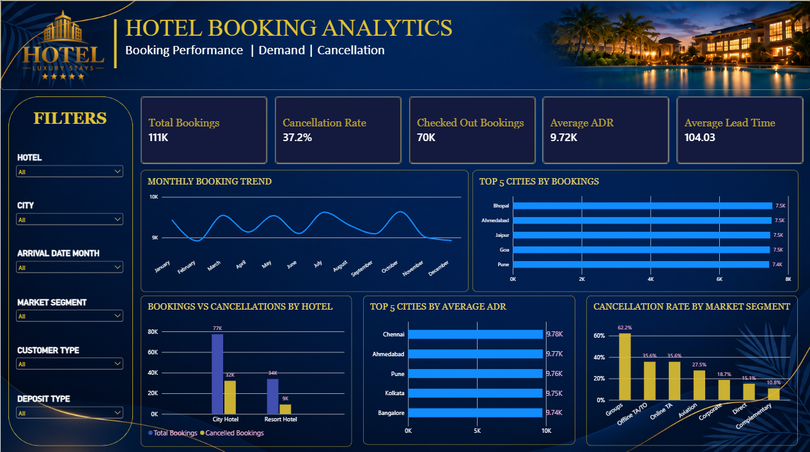
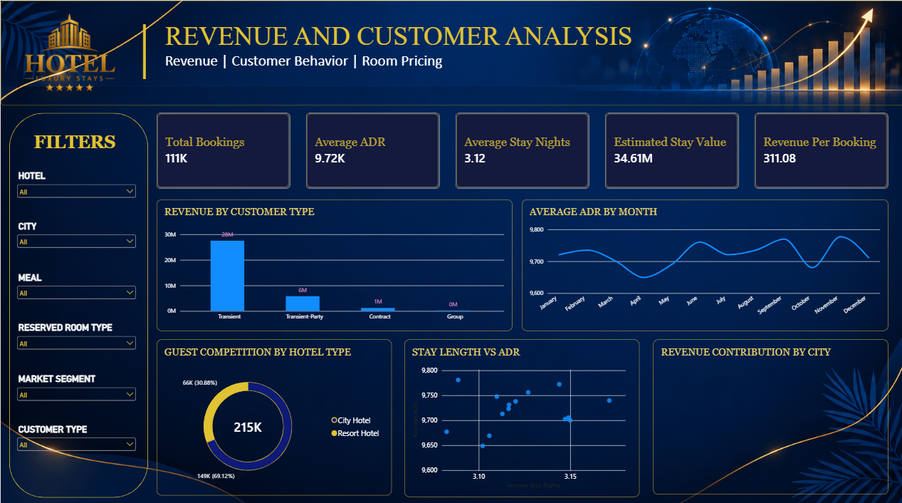

# Hotel Booking Analysis & Interactive Dashboard

An end-to-end hotel booking analytics project that transforms reservation-level data into an interactive Power BI dashboard for analyzing booking demand, cancellation behaviour, pricing, stay duration, and customer and property patterns.

## 📌 Project Overview

Hotels generate a large volume of reservation data, but booking volume alone does not explain business performance.

This project analyzes hotel reservation data to understand:

- Booking demand and booking patterns
- Cancellation behaviour and demand stability
- Pricing and stay-duration patterns
- Customer and market segment behaviour
- Hotel and geographical booking patterns
- Booking value-related patterns

The project combines **Python-based data preparation and analysis** with an **interactive Power BI dashboard**.

---

## 🎯 Problem Statement

The objective of this project is to transform reservation-level hotel data into clear, interactive information that can help identify:

- Demand patterns
- Cancellation risks
- Pricing behaviour
- Value-driving segments
- Customer and property-level booking patterns

The dashboard is designed around four key questions:

1. **Demand** — How many bookings are coming in, when do they occur, and where are they concentrated?
2. **Stability** — How much of that demand is cancelled, and which segments require closer investigation?
3. **Value** — What pricing and stay-duration patterns are associated with bookings?
4. **Customer & Property Behaviour** — Which customer types, market segments, room types, meal choices, and cities are associated with different booking patterns?

---

## 🛠️ Technologies Used

- **Python**
- **Pandas**
- **NumPy**
- **Matplotlib**
- **Seaborn**
- **Microsoft Excel**
- **Power BI**
- **Google Colab**

---

## 🔄 Project Workflow

```text
Raw Hotel Booking Data
        ↓
Python / Pandas Data Preparation
        ↓
Prepared Dataset
        ↓
Power BI Analysis
        ↓
Interactive Dashboard
        ↓
Business Insights

---

## 📊 Power BI Dashboard

### Booking Performance, Demand & Cancellation



### Revenue & Customer Analysis



---

## 🔗 Data Cleaning Notebook

The data cleaning and preparation process was performed using Python and Pandas in Google Colab.

[Open Data Cleaning Notebook](https://colab.research.google.com/drive/1aqvnjAClw24iJ8WZWhGKppFaAwSQmeXM?usp=sharing)
